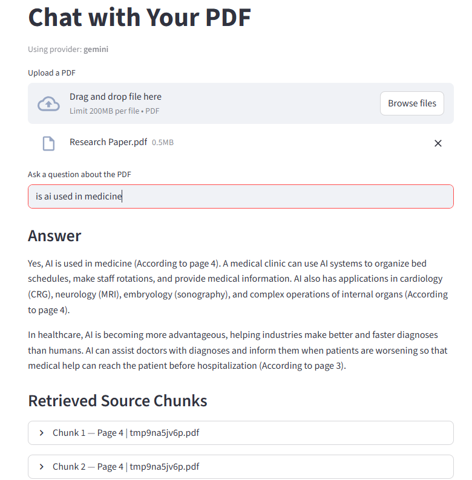
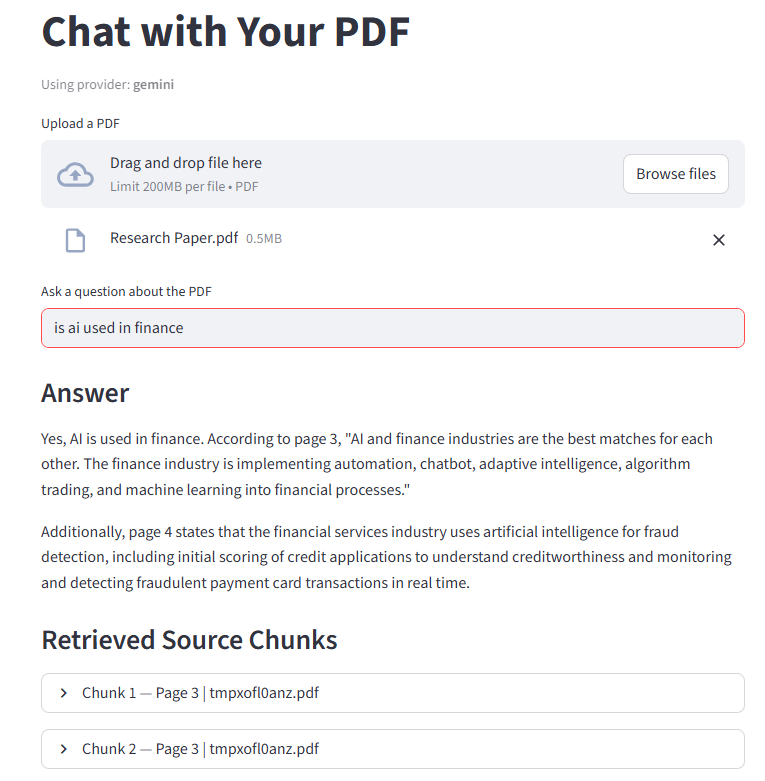

# PDF RAG App

A Streamlit application that lets you upload a PDF and ask questions about it using Retrieval-Augmented Generation (RAG). Supports both OpenAI and Google Gemini as LLM/embedding providers.




## Features

- Upload any PDF and query its contents in natural language
- Answers cite the page numbers where the information was found
- Retrieved source chunks are shown with their page numbers
- Switchable between OpenAI and Google Gemini via a single environment variable

## Project Structure

```
pdf-rag-app/
├── app.py                        # Streamlit UI (thin orchestration layer)
├── services/
│   ├── pdf_service.py            # PDF loading, splitting, page-number normalisation
│   ├── embedding_service.py      # Embeddings, FAISS vectorstore, retriever
│   └── llm_service.py            # LLM creation, prompt building, answer generation
├── Test_data/
│   └── Research Paper.pdf        # Sample PDF for testing the app
├── requirements.txt
└── .env                          # API keys (never commit this file)
```

## Setup

### 1. Create and activate a virtual environment

```bash
python -m venv venv1
# Windows
venv1\Scripts\activate
# macOS/Linux
source venv1/bin/activate
```

### 2. Install dependencies

```bash
pip install -r requirements.txt
```

### 3. Configure environment variables

Create a `.env` file in the project root:

```env
# Choose "openai" or "gemini"
LLM_PROVIDER=openai

# OpenAI
OPENAI_API_KEY=your-openai-api-key

# Google Gemini (only required when LLM_PROVIDER=gemini)
GOOGLE_API_KEY=your-google-api-key
```

> **Security:** Never commit your `.env` file or paste API keys into any tracked file.

## Running the App

```bash
streamlit run app.py
```

Once the app is running, upload any PDF to start asking questions. A sample research paper is included in the `Test_data/Research Paper.pdf` file for you to try out the application.
